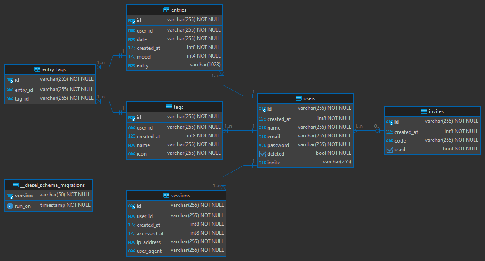

<h1 align="center">
  📆 Ephemeride
</h1>

<p align="center">
  A mood tracking / short journaling web app built with Rust and Svelte.
</p>

<p align="center">
  
</p>

## 👩‍💻 Getting Started

### ⚒️ API

All of the following commands should be run from the `api` directory.

```bash
$ cd api
```

#### Run

```bash
$ cargo run
```

#### Test

```bash
$ cargo test
```

#### Lint

```bash
$ cargo fmt
$ cargo clippy
```

#### Build

```bash
$ cargo build
```

### 🖥️ Frontend

All of the following commands should be run from the `frontend` directory.

```bash
$ cd frontend
```

#### Install

```bash
$ yarn
```

#### Build

When the frontend is built, it can be served by the API.

```bash
$ yarn build
```

#### Dev Server

```bash
$ yarn dev
```

### ⛽ Diesel

This project uses [Diesel](https://diesel.rs/) and Postgres.

Running this project requires installation and setup of both `diesel_cli` and `postgresql`, as well as creating a `.env` file to store the database url.

### 🐚 setup.sh

There is a `setup.sh` script that will install the required dependencies, setup the database, and create required `.env` files.

> ⚠️ **WARNING:** This will overwrite any existing `.env` files.

```bash
$ ./setup.sh
```

### 📝 Manual Setup

#### Installing postgres

```bash
$ sudo apt-get install postgresql postgresql-contrib libpq-dev
$ sudo -u postgres createuser <username>
$ sudo -u postgres createdb <database>
```

#### Creating a user and database

```sql
$ sudo -u postgres psql
psql=# ALTER USER <username> WITH PASSWORD <password>;
psql=# GRANT ALL PRIVILEGES ON DATABASE <database> TO <username>;
```

#### Installing diesel_cli and running migrations

```bash
$ cd api
$ cargo install diesel_cli --no-default-features --features postgres
$ echo DATABASE_URL=postgres://<username>:<password>@<host>/<database> > .env
$ diesel setup
$ diesel migration run
```

#### Redoing migrations

```bash
$ cd api
$ diesel migration redo --all
```

## 🩺 API Tests

GitHub actions will run `cargo test ci --verbose` on commit to `main` or when creaing a pull request. In order to have an API test run using GitHub actions, include `ci` in the test name.

As an example `util::unix_time::ci_unit::positive` could be defined as:

```rust	
#[cfg(test)]
mod ci_unit {
  use super::*;

  #[test]
  fn positive() {
    let unix_time = unix_time();

    assert!(unix_time > 0, "unix_time should be positive");
  }
}
```

## 📂 Conventional Commits

This project uses [Conventional Commits](https://www.conventionalcommits.org/en/v1.0.0/) to manage commits.

Use the following format when committing:

```bash
$ git commit -m "type(scope): message"
```

### 📃 Commit Types

`feat` A new feature

`fix` A bug fix

`docs` Documentation only changes

`style` Changes that do not affect the meaning of the code

`refactor` A code change that neither fixes a bug nor adds a feature

`perf` A code change that improves performance

`test` Adding missing tests or correcting existing tests

`build` Changes that affect the build system or external dependencies

`ci` Changes to our CI configuration files and scripts

`chore` Other changes that don't modify src or test files

`revert` Reverts a previous commit

### 📚 Scope

The scope is optional and should be a GitHub issue number if applicable.

## 📖 DB Schema



[DBeaver](https://dbeaver.io/) was used to generate the schema diagram, diagram generated 2024-02-24 17:09

---

<br />

<p align="center"><i>But how could you live and have no story to tell?</i> — Fyodor Dostoevsky<br>🖤</p>

<br />
